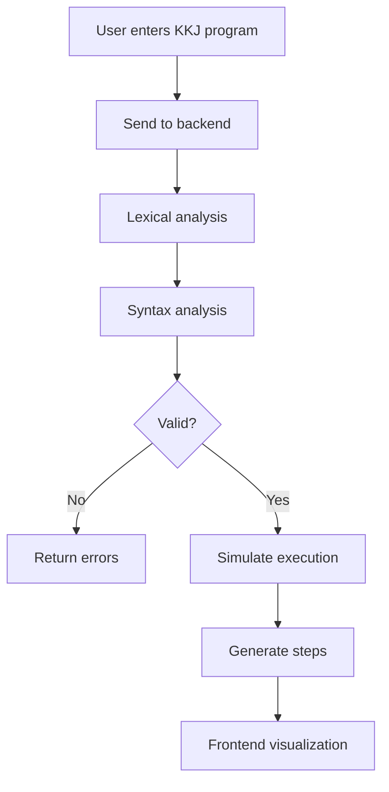

# 🎓 Visual Representation of Program Execution in KKJ

This project provides a **visual representation of program execution** for programs written in the **KKJ language**. It is designed as an educational tool that helps users understand how programs are analyzed and executed step by step.

The application is built as a **full-stack system**:
- **Frontend:** React
- **Backend:** Java (lexical + syntactic analyzer + execution simulator)

---

## 🚀 Features

- ✍️ Write and submit a program in KKJ
- 🔍 Perform lexical and syntactic analysis
- ❌ Display errors if the program is invalid
- ▶️ Simulate program execution
- ⏱️ Step-by-step execution
- 📊 Visualize program state during execution

---

## 🏗️ Architecture

### 🖥️ Frontend (React)
- Code editor for KKJ programs
- Displays errors and execution steps
- Visualizes program execution
- Communicates with backend via REST API

### ⚙️ Backend (Java)
- Lexical analyzer (tokenization)
- Syntax analyzer (parser)
- Semantic validation (if implemented)
- Execution simulator
- Generates execution steps for visualization

---

## 🔄 Application Workflow



---

## 🧪 Example Usage

### Example KKJ Program

```txt
var x = 5;
var y = 10;
x = x + y;
```

---

### Example API Request

```bash
curl -X POST http://localhost:8080/api/analyze \
  -H "Content-Type: application/json" \
  -d '{
    "code": "var x = 5; var y = 10; x = x + y;"
  }'
```

---

### Example API Response (Valid Program)

```json
{
  "valid": true,
  "steps": [
    { "step": 1, "variables": { "x": 5 } },
    { "step": 2, "variables": { "x": 5, "y": 10 } },
    { "step": 3, "variables": { "x": 15, "y": 10 } }
  ]
}
```

---

### Example API Response (Error)

```json
{
  "valid": false,
  "errors": [
    {
      "line": 1,
      "message": "Unexpected token"
    }
  ]
}
```

---

## 🛠️ Technologies

### Frontend
- React
- JavaScript / TypeScript
- HTML / CSS

### Backend
- Java
- Compiler design principles
- Custom lexical and syntax analyzer

---

## ▶️ Getting Started

### 1. Clone the repository

```bash
git clone https://github.com/martinmormak/Diploma_project_-_Visual_representation_of_program_execution_in_a_KKJ.git
cd Diploma_project_-_Visual_representation_of_program_execution_in_a_KKJ
```

---

### 2. Run Backend

```bash
cd backend

# If using Maven:
mvn clean install
mvn spring-boot:run

# OR Gradle:
./gradlew build
./gradlew bootRun
```

---

### 3. Run Frontend

```bash
cd frontend
npm install
npm start
```

---

## 🎯 Project Goal

The goal of this project is to:
- Help students understand how programs are executed internally
- Visualize key concepts such as:
  - Variable state
  - Execution flow
  - Stack (if implemented)

---

## 🔮 Future Improvements

- Support for more programming constructs
- Advanced visualization (stack frames, memory model)
- Interactive debugging
- Export execution trace
- Multi-language support

---

## 👨‍💻 Author

**Martin Mormák**
