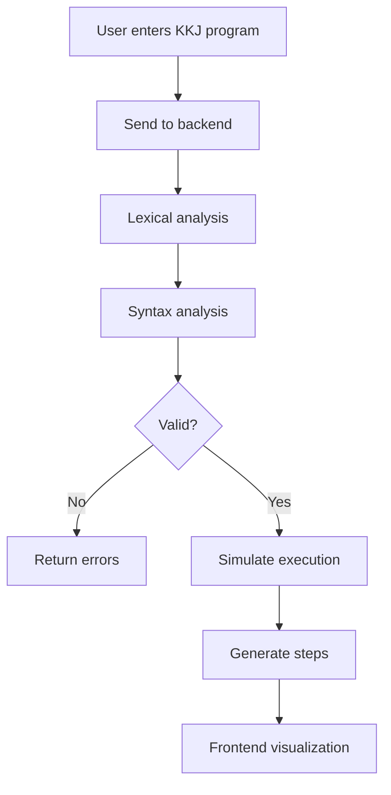

# 🎓 Visual Representation of Program Execution in KKJ

This project provides a **visual representation of program execution** for programs written in the **KKJ (Concatenative Composite Language)**. It is designed as an educational tool that helps users understand how programs are analyzed and executed step by step.

The application is built as a **full-stack system**:
- **Frontend:** React
- **Backend:** Java (lexical + syntactic analyzer + execution simulator)

---

## 🚀 Features

- ✍️ Write and submit a program in KKJ (Concatenative Composite Language)
- 🔍 Perform lexical and syntactic analysis
- ❌ Display errors if the program is invalid
- ▶️ Simulate program execution
- ⏱️ Step-by-step execution
- 📊 Visualize program state during execution (including stack behavior)

---

## 🏗️ Architecture

### 🖥️ Frontend (React)
- Code editor for KKJ programs
- Displays errors and execution steps
- Visualizes program execution
- Communicates with backend via REST API

### ⚙️ Backend (Java)
- Lexical analyzer (tokenization)
- Syntax analyzer (parser)
- Validation of program structure
- Execution simulator for concatenative language
- Stack-based execution model
- Generates execution steps for visualization

---

## 🔄 Application Workflow



---

## 🧪 Example Usage

### Example KKJ Program

```txt
5 10 + print
```

---

### Example API Request

```bash
curl -X POST http://localhost:8080/api/analyze \
  -H "Content-Type: application/json" \
  -d '{
    "code": "5 10 + print"
  }'
```

---

### Example API Response (Valid Program)

```json
{
  "valid": true,
  "steps": [
    { "step": 1, "stack": [5] },
    { "step": 2, "stack": [5, 10] },
    { "step": 3, "stack": [15] },
    { "step": 4, "output": 15 }
  ]
}
```

---

### Example API Response (Error)

```json
{
  "valid": false,
  "errors": [
    {
      "line": 1,
      "message": "Invalid token or operation"
    }
  ]
}
```

---

## 🛠️ Technologies

### Frontend
- React
- JavaScript / TypeScript
- HTML / CSS

### Backend
- Java
- Compiler design principles
- Custom lexical and syntax analyzer
- Stack-based interpreter

---

## 🎯 Project Goal

The goal of this project is to:
- Help students understand execution in **concatenative programming languages**
- Visualize key concepts such as:
  - Stack operations
  - Execution flow
  - Step-by-step evaluation

---

## 🔮 Future Improvements

- Support for more complex KKJ constructs
- Advanced visualization (stack frames, memory model)
- Interactive debugging
- Export execution trace
- Enhanced error diagnostics

---

## 👨‍💻 Author

**Martin Mormák**
